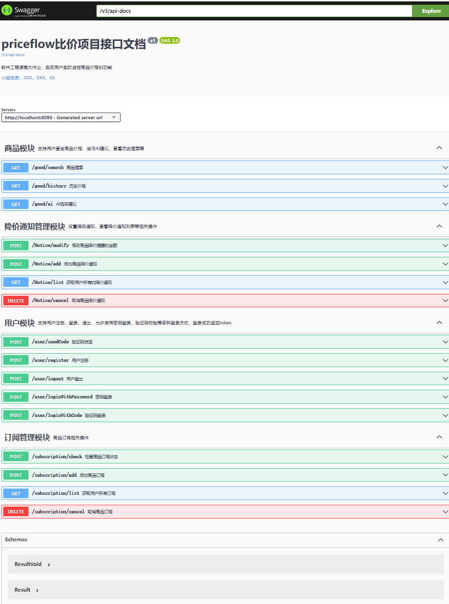

# PriceFlow

武汉大学软件工程大作业，小组成员：XXX、XXX、XX

## 后端
### 运行
	- 在mysql中建立priceflow数据库，并在执行init.sql语句建立表格
	- 在application修改redis和mysql的配置信息，
### 项目结构介绍
整体使用springBoot框架，分为四大模块：用户模块、商品模块、订阅模块、通知模块，使用IDEA打开项目的pom文件，修改spring.yaml文件中的mysql和redis的配置信息后即可允许，运行端口：localhost:8080
	- 用户模块：包含注册、登录功能，支持密码登录、验证码登录，密码使用MD5算法进行加密保存。登录成功后服务器生成一个token放在redis中，并将token返回给前端，通过双拦截器校验用户token有效性、已经无感刷新token过期时间。
	- 商品模块：包含AI询问建议、多平台爬取商品信息、查看搜索记录等功能，调用了第三方ai的API接口，同时支持用户的选择爬取京东、淘宝、拼多多等平台的商品数据。
	- 订阅模块：支持用户对商品进行订阅，类似于收藏夹。
	- 通知模块：用户对商品设置一个期望价格保存在通知表中，服务器通过定时任务扫描通知表，如何商品的价格低于用户设置的期望价格，向用户发送一个降价通知邮件。

###  文档
- API接口文档：
	使用springdoc自动生成接口文档，两种方式可查看文档：
	1. 使用IDEA运行项目，然后打开在线生成的文档<http://localhost:8080/swagger-ui/index.html#/>
	2. 使用Apioost、Postman等接口工具，将`doc/api接口文档.json`文件导入进工具，生成接口文档
	接口文档效果图如下图所示：
	
- 数据库表结构文档：
	打开`doc/数据库表结构文档.html`即可查看，或者点击链接[数据库表结构文档](doc/数据库表结构文档.html)
### API文档

